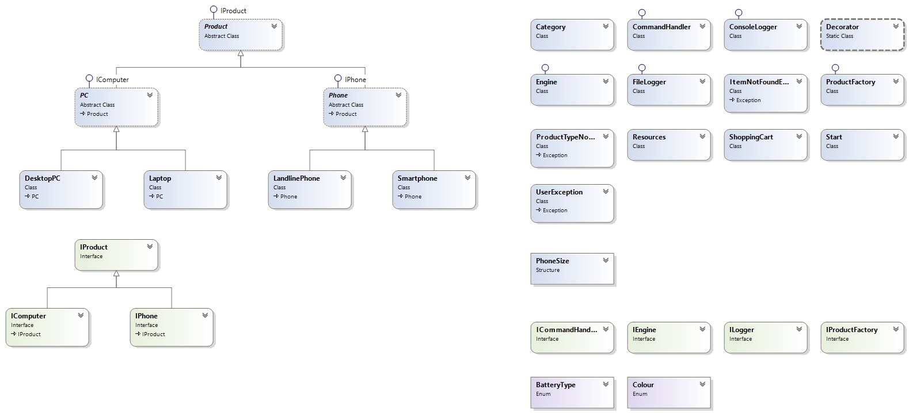

## ELECTRONICS SHOP

## TEAM: ss_dody, NevenaN, Shabanali 

## PROJECT PURPOSE:
Following the project requirements, we decided to create a shop for electronics. The products in our shop are devided into two main categories - phones and computers with subcategories - smartphones and landline phones, laptops and desktop computers. The shop has a shopping cart, to which products can be added or removed and which calculate the total price of the purchase.

## CLASS DIAGRAM:

## GitLab URL: https://gitlab.com/Shaban_971/Teamwork.git

